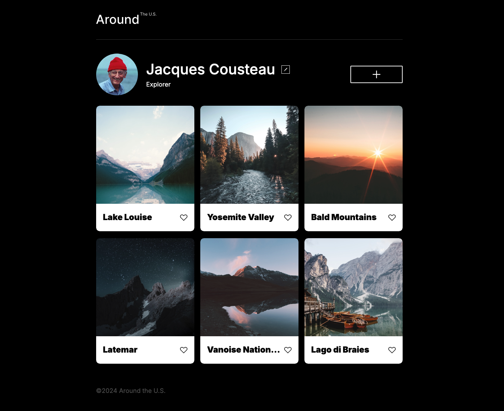
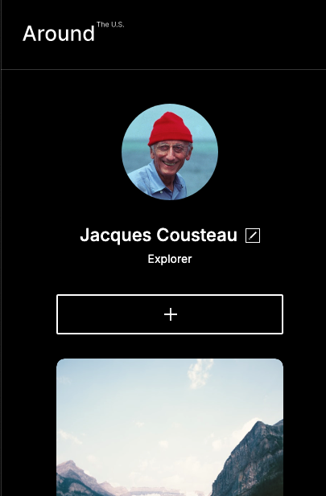

# Project 3: Around The U.S.

### Overview  

* Intro  
* Figma  
* Images  

### Techniques

* HTML  
* CSS  
* Responsive design  
  
**Intro**
  
This project is made so all the elements are displayed correctly on popular screen sizes. 

**Figma**  
  
* [Link to the project on Figma](https://www.figma.com/file/ii4xxsJ0ghevUOcssTlHZv/Sprint-3%3A-Around-the-US?node-id=0%3A1)  
  
**Images**  

Here is what the site looks like on desktop:
  

And here is the mobile view: 

